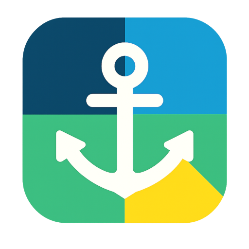
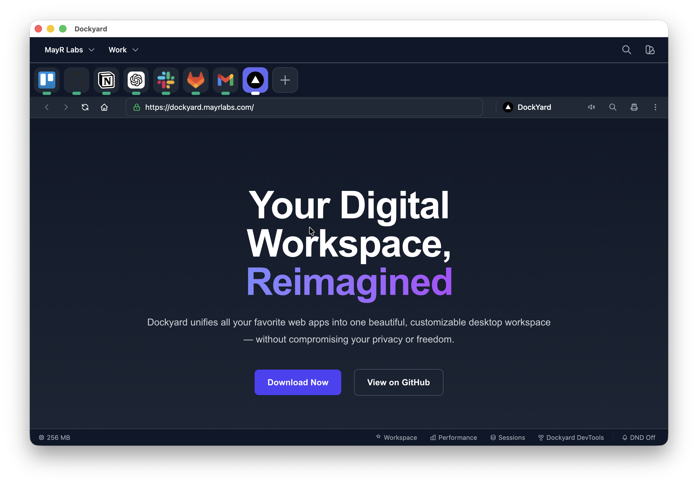
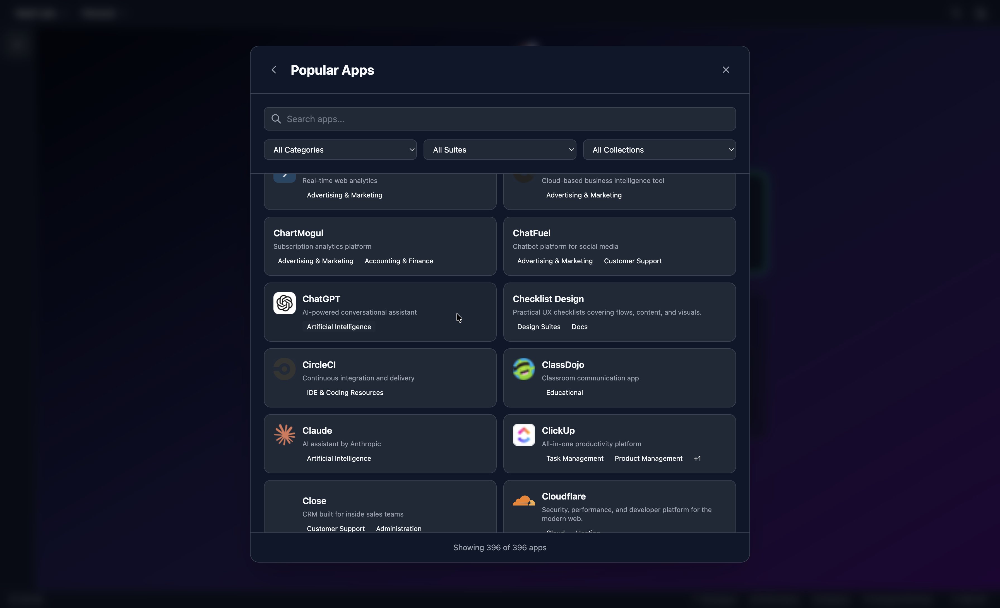
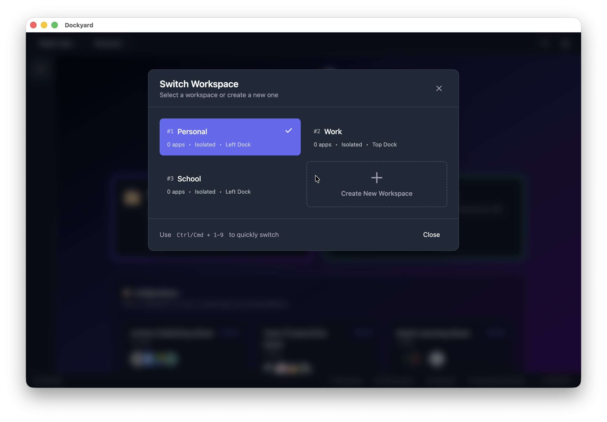
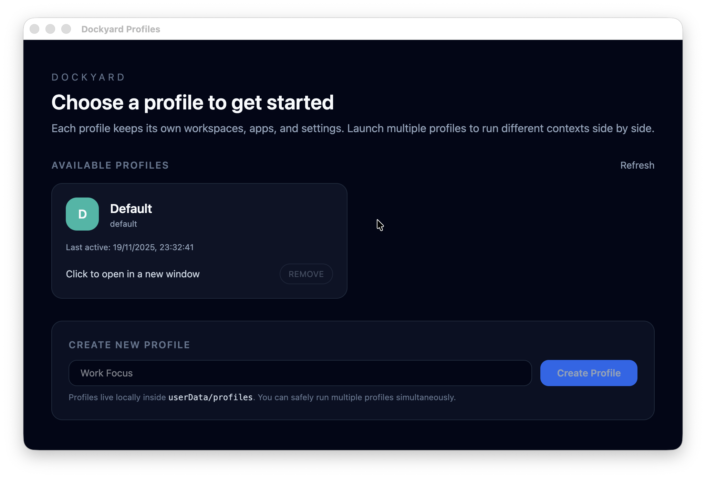
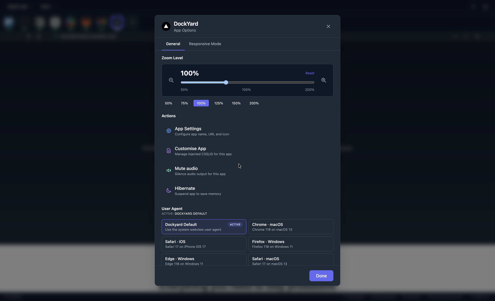
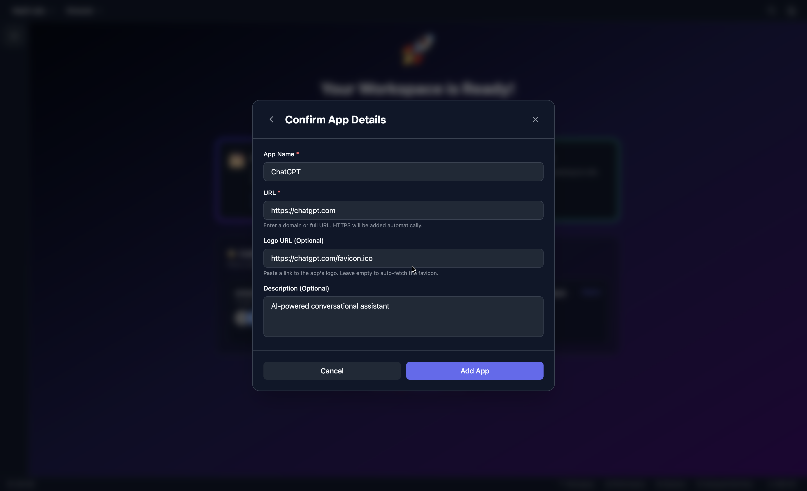
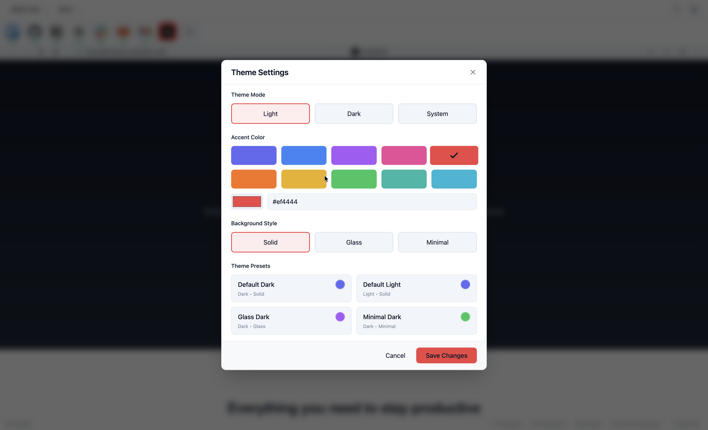
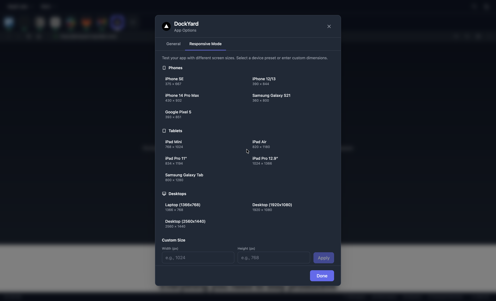

<p align="center">
  
</p>

<h1 align="center">Dockyard</h1>

> Open, local-first workspace that hosts every web app you care about without handing your data to someone else.

Dockyard combines Electron, React, Vite, and TailwindCSS to provide a hacker-friendly alternative to proprietary "multi-messenger" tools. Profiles isolate your data, workspaces group related apps, and BrowserViews load each service with strict sandboxing so you can focus on the work that matters.

- [Visual Tour](#visual-tour)
- [Philosophy](#philosophy)
- [Core Concepts](#core-concepts)
- [Feature Highlights](#feature-highlights)
  - [Workspace \& App Management](#workspace--app-management)
  - [Customisation \& UI](#customisation--ui)
  - [Productivity \& Performance](#productivity--performance)
  - [Notifications \& Privacy](#notifications--privacy)
  - [Planned / Experimental](#planned--experimental)
- [Architecture \& Tech Stack](#architecture--tech-stack)
- [Security, Privacy \& Data](#security-privacy--data)
- [Getting Started](#getting-started)
  - [Prerequisites](#prerequisites)
  - [Installation \& Local Run](#installation--local-run)
  - [Helpful Scripts](#helpful-scripts)
- [Development Workflow](#development-workflow)
- [Packaging \& Distribution](#packaging--distribution)
- [Release Process](#release-process)
- [Roadmap Snapshot](#roadmap-snapshot)
- [Contributing](#contributing)
- [License](#license)

---

## Visual Tour

| App layout overview                                             | Add an app                                          |
| --------------------------------------------------------------- | --------------------------------------------------- |
|  |  |

| App selection catalog                                         | Create workspace flow                                            |
| ------------------------------------------------------------- | ---------------------------------------------------------------- |
|  |  |

| Switch workspace palette                                                 | Multi-profile picker                                               |
| ------------------------------------------------------------------------ | ------------------------------------------------------------------ |
|  |  |

| Customise app controls                                           | Advanced app customisation                                        |
| ---------------------------------------------------------------- | ----------------------------------------------------------------- |
|  |  |

| Theme controls                                                | Responsive layout presets                                                 |
| ------------------------------------------------------------- | ------------------------------------------------------------------------- |
|  |  |

---

## Philosophy

Dockyard exists for creators, developers, and power users who are tired of juggling dozens of tabs and bloated proprietary "productivity" suites. The guiding principles are simple:

1. **Freedom** – run any web tool, tweak every detail, fork the project if you want.
2. **Flexibility** – the workspace adapts to your habits: profiles, layouts, and themes are yours to define.
3. **Focus** – hide distractions, hibernate idle apps, and keep context switches intentional.

Everything runs locally, no telemetry ships anywhere, and you stay in control of your environment.

---

## Core Concepts

- **Profiles** – complete browser-like sandboxes. Launch multiple Dockyard instances (e.g., `npm start -- --profile=work`) to separate work and personal data with independent stores.
- **Workspaces** – goal-focused collections of apps ("Design", "Operations", "Research"). They own layout, theme overrides, and hibernation rules.
- **Apps & Instances** – add curated or custom URLs, duplicate them for multiple accounts, and choose whether each instance shares a workspace partition or keeps a fully isolated session (`persist:app-{appId}-{instanceId}`).
- **Customization** – drag-to-order docks, place them on any edge, apply light/dark/system themes, change accent colors, and inject custom CSS/JS per app when needed.
- **Performance** – idle apps auto-hibernate after 15 minutes by default, resume instantly, and expose memory/CPU stats so you know what is consuming resources.

---

## Feature Highlights

### Workspace & App Management
- Unlimited profiles, workspaces, and app instances
- Session isolation with optional workspace-shared partitions
- BrowserView-based rendering for better performance than `<webview>`
- Multi-column / split layouts with detachable windows and per-app zoom

### Customisation & UI
- Light, dark, or system themes plus accent controls and glass/solid backgrounds
- Configurable docks (top/bottom/left/right) with drag-and-drop ordering
- Custom icon upload or auto-fetched favicons; per-app CSS/JS overrides
- Keyboard shortcuts throughout; quick workspace switching is in development

### Productivity & Performance
- Auto-hibernation per app/workspace, with resumable BrowserViews
- Performance monitor hooks to inspect memory/CPU per app
- Workspace-level hibernation, layout presets, and optional Focus/Do Not Disturb modes

### Notifications & Privacy
- Native OS notifications that can refocus the originating app
- Notification badges plus global Do Not Disturb toggle
- Zero telemetry, local JSON storage via `electron-store`, and secure IPC bridges

### Planned / Experimental
- Automation hooks, quick launcher, local backup/export tooling
- Plugin API, curated "app store", LAN workspace sharing, advanced theming packs

---

## Architecture & Tech Stack

| Layer         | Technology                 | Notes                                                       |
| ------------- | -------------------------- | ----------------------------------------------------------- |
| Desktop shell | Electron 39+               | Cross-platform window management, BrowserViews              |
| Main process  | TypeScript + Node.js       | Window, profile, and IPC orchestration                      |
| Renderer      | React 19 + Vite 7          | SPA UI with hot reload                                      |
| State         | Zustand 5                  | Lightweight stores for profiles, apps, workspaces, settings |
| Styling       | TailwindCSS 4 + custom CSS | Utility-first theming                                       |
| Animations    | Framer Motion 12           | Smooth transitions                                          |
| Storage       | electron-store 11          | Local JSON persistence per profile                          |

```
src/
├─ main/          # Electron lifecycle, BrowserView management, IPC handlers
├─ preload/       # contextBridge-exposed APIs with strict allowlists
├─ renderer/      # React UI, Zustand stores, hooks, components, styles
└─ shared/        # Types, constants, helpers shared across processes
assets/icons/     # Cross-platform icon set (ico/icns/png)
forge.config.js  # Electron Forge makers + GitHub publisher config
.github/workflows/release.yml  # Release builds for macOS, Linux, Windows
```

Key services include `window-manager.ts` for lifecycle, `browser-view-manager.ts` for view placement, and IPC handlers under `src/main/handlers/` to keep domains (profiles, workspaces, apps, settings) isolated and testable.

---

## Security, Privacy & Data

- `contextIsolation` enabled, `nodeIntegration` disabled, sandbox on.
- IPC is namespaced (`profile:*`, `workspace:*`, `app:*`) and validated server-side.
- Each BrowserView receives sanitized URLs, strict partition naming, and optional session clearing utilities.
- Data lives only on disk via `electron-store`:
  - macOS: `~/Library/Application Support/dockyard-electron/`
  - Windows: `%APPDATA%/dockyard-electron/`
  - Linux: `~/.config/dockyard-electron/`
- No analytics libraries, trackers, or background network calls beyond the sites you load.

---

## Getting Started

### Prerequisites
- Node.js 18+ and npm
- Git
- macOS, Windows, or Linux workstation

### Installation & Local Run

```bash
git clone https://github.com/MayR-Labs/dockyard-electron.git
cd dockyard-electron
npm install

# Development (build main, start Vite dev server, launch Electron)
npm run dev

# Production build
npm run build

# Package or make distributables for the current platform
npm run package
npm run make
```

### Helpful Scripts
- `npm run build:main` / `build:renderer` – compile processes independently.
- `npm start` – build everything then launch Electron in production mode.
- `npm run make -- --platform=linux --arch=x64` – cross-target builds (requires platform tooling; see Packaging section).
- Multi-profile launch: `npm start -- --profile=work`.

---

## Development Workflow

1. **Bootstrapping** – `npm run dev` builds the main process once, watches it, serves renderer via Vite, and launches Electron with `VITE_DEV_SERVER_URL`.
2. **State & IPC** – shared types live under `src/shared/types`; preload (`src/preload/index.ts`) exposes a strict `window.dockyard` API so renderer stores can call `window.dockyard.workspaces.list()` etc.
3. **UI Composition** – React components live in feature folders (AppDock, Layout, Modals, ProfilePicker). Zustand stores encapsulate fetch/update logic.
4. **Debugging** – Renderer DevTools auto-open in dev; main process logs show in the terminal. Use BrowserView-specific DevTools or the dedicated “Dev Mode” view for stubborn apps.
5. **Data** – Inspect the profile directories listed above if you need to reset or edit JSON manually.

---

## Packaging & Distribution

Electron Forge is configured in `forge.config.js` to produce installers for every platform:

- **Windows** – `@electron-forge/maker-squirrel` with `assets/icons/icon.ico`.
- **macOS** – ZIP + DMG (`@electron-forge/maker-zip`, `@electron-forge/maker-dmg`).
- **Linux** – `.deb` and `.rpm` with icons under `assets/icons/icon.png`.
- **GitHub Publisher** – Drafts releases via `@electron-forge/publisher-github` (`MayR-Labs/dockyard-electron`).

Local packaging commands:

```bash
# Current platform artifacts
npm run make

# Cross-build examples (host OS tooling required)
npm run make -- --platform=win32 --arch=x64   # needs Wine + Mono on macOS/Linux
npm run make -- --platform=linux --arch=x64  # needs dpkg, rpm, fakeroot

# Publish installers + release assets (respects forge config)
npm run publish
```

For Windows builds on macOS/Linux install Wine + Mono; for Linux artifacts install `dpkg`, `rpm`, and `fakeroot` (already handled automatically in CI for Ubuntu runners).

---

## Release Process

Automated release builds live in `.github/workflows/release.yml` and run on macOS, Windows, and Linux:

1. **Version & changelog** – update `package.json` and any release notes.
2. **Tag** – `git tag vX.Y.Z && git push origin main --tags` (workflow triggers on `v*` tags). You can also run it manually via *Actions → Release Builds → Run workflow*.
3. **CI Build** – each OS job runs `npm ci`, installs platform prerequisites, executes `npm run publish`, and uploads installers to a draft release via the GitHub publisher.
4. **Review artifacts** – wait until all three jobs succeed; download test builds if needed.
5. **Publish** – edit the draft release on GitHub (add notes, screenshots, etc.) and click **Publish release**. Re-running the workflow for the same tag refreshes binaries.

That is it—no extra secrets beyond the default `GITHUB_TOKEN` are required.

---

## Roadmap Snapshot

- ✅ **Phase 1** – Core architecture (profiles, IPC, storage).
- ✅ **Phase 2** – Workspace and app management, BrowserViews, custom apps.
- ✅ **Phase 3** – Session management, auto-hibernation, performance monitors.
- ✅ **Phase 4** – Layout system, native notifications, badge handling.
- ✅ **Phase 5** – Theming, customization, profile picker polish.

Upcoming ideas include automation hooks, quick launcher, plugin APIs, backup/export utilities, and tighter performance instrumentation. Contributions in those areas are welcome.

---

## Contributing

1. Fork the repo and create a feature branch.
2. Run `npm run lint` and ensure builds succeed.
3. Stick to focused, TypeScript-first changes; keep UI logic and IPC separated per the architecture above.
4. Submit a PR describing the change, tests performed, and any screenshots when UI is affected.

Issues and discussions live on GitHub—bug reports, feature proposals, and design critiques are all appreciated.

---

## License

MIT License © MayR Labs. Use it, fork it, reship it—just keep it open.

---

Built with care for privacy-focused hackers everywhere.
